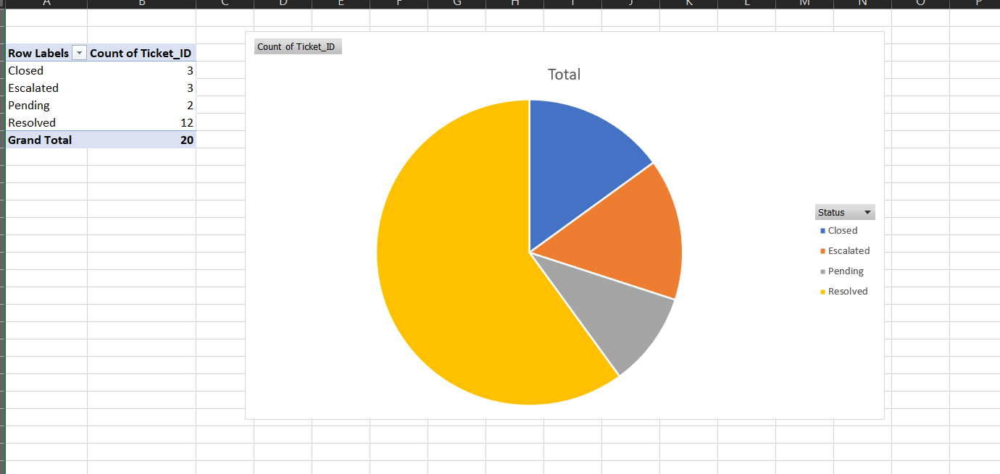

# 📊 Support Ticket Visualization Dashboard (Excel)

This project analyzes and visualizes support ticket data using **Excel Pivot Tables**, **Charts**, and **Summary KPIs**.  
It helps understand support performance, issue trends, and SLA (Service Level Agreement) compliance — essential skills for a **Quality Business Analyst** role.

---

## 🖼️ Dashboard Preview

*(This image shows the Excel dashboard created from the ticket dataset.)*

---

## 📝 Project Overview

The dataset contains support tickets with the following fields:

- Ticket ID  
- Issue Type  
- Priority  
- Assigned To  
- Resolution Time (hours)  
- Status  
- SLA Breached (Yes/No)

The goal of this project is to visualize these tickets and extract meaningful insights using Excel.

---

## 🎯 Key Features

### ✔ Summary KPI Metrics
- **Total Tickets:** 20  
- **Average Resolution Time:** 8.2 hours  
- **High Priority Tickets:** 10  
- **SLA Breaches:** 0  
- **SLA Breach %:** 0%

---

### ✔ Pivot Table Analysis
Used Excel Pivot Tables to analyze:

- Distribution of Issue Types  
- Priority-wise Ticket Breakdown  
- Status Distribution (Resolved, Pending, Escalated, Closed)  
- SLA Breach Count  

---

### ✔ Interactive Dashboard
The dashboard includes:

- Bar Chart — Issue Type Distribution  
- Pie Chart — Ticket Status Distribution  
- Column Chart — Average Resolution Time by Priority  
- Donut Chart — SLA Breach Analysis  
- KPI Summary Section  

All visuals are neatly combined in a single Excel dashboard.

---

## 🔍 Insights Observed

- No tickets breached SLA → **100% SLA compliance**.  
- High-priority tickets represent a major portion of total workload.  
- Issues like "App Crash" and "Payment Failure" appear frequently.  
- Resolution times across most tickets are within acceptable range.  

---

## 🛠 Tools Used

- Microsoft Excel 2019  
- Pivot Tables  
- Pivot Charts  
- Basic formulas (AVERAGE, COUNTIF, IF)

---

## 🧠 Skills Demonstrated

- Data Visualization  
- KPI Reporting  
- Analytical Thinking  
- Data Quality Checking  
- Excel Proficiency  
- Business Understanding

---

## 👨‍💼 Why This Project Is Relevant for QBA Roles

This project demonstrates:

- Ability to analyze ticket operations  
- Understanding of SLA and performance metrics  
- Skill in creating dashboards and visual reports  
- Capability to derive insights from raw data  

These are key expectations for **Quality Business Analyst** roles.

---

## 🙌 Author

**Yogeshwaran T**  
Entry-Level Analyst | Data & Quality Enthusiast  

